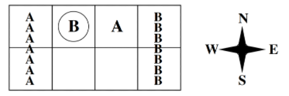
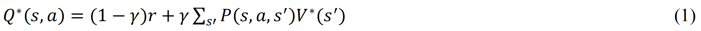
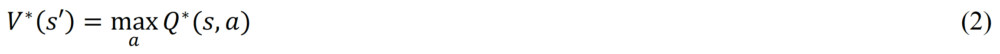
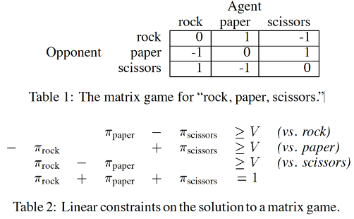

# Markov games, a case study

### Code overview

- `soccer.py` implements the soccer game enviroment, with `reset`, `step` and `render` fucntions similar to those of an OpenAI gym enviroment
- `agents.py` implements an interface to unify all the player algorithms used in the game. It implements an `act` function that produces player action and `learn` function that takes current state action and reward information to learn the Q table and policy for that player.
- `randomAgent.py` implements a random player
- `QlearningAgent.py` implements a Q learning player.
- `CEQ.py` implements a utilitarian CE-Q player.
- `FoeQ.py` implements a Foe-Q player.
- `FriendQ.py` implements a Friend-Q player.
- `game_interface.py` implements the game interface, where it takes the game enviroment and implementations of the agent and the opponent to play the game.
- `run_game.py` uses all the code above to test the performance and convergence of different algorithms.

### The soccer game enviroment

Here I am going to implement different learning agents to solve a grid game called “the soccer game” and analyze their convergence and performance. The game mechanism is described in [1] “The soccer field is a grid. The circle represents the ball. There are two players, whose possible actions are N, S, E, W, and stick. The players’ actions are executed in random order. If this sequence of actions causes the players to collide, then only the first moves. But if the player with the ball moves second, then the ball changes possession. If the player with the ball moves into a goal, then he scores +100 if it is in fact his own goal and the other player scores −100, or he scores −100 if it is the other player’s goal and the other player scores +100. In either case, the game ends.” The starting positions for A, B and the ball possession in the beginning is random. Soccer game is an instance of Markov games.

### Markov games
A Markov Decision Process (MDP) is defined by a set of states (S), actions (A), the transition function P(s,a,s’) and the reward function R(s,a,s’) [2]. The two functions reflect the Markovian property that it is memoryless. In an MDP, the agent acts alone to try to maximize the long-term discounted reward at each step. An MDP can be solved using Q-learning based on the Bellman equation [1].

Where V*(s') is the expected utility following the optimal policy π*. In the case of MDP:

MDP is a very useful model in reinforcement learning and has helped researchers in this filed to very impressive achievements such as Gerald Tesauro’s celebrated work on TD-Gammon, which enabled a program to learn and play the game of backgammon at the grandmaster level [3] and the program AlphaGo developed by a team at DeepMind to master the game of Go [4]. However, in the real world, no agent lives in a vacuum and it needs to interact with other agents, engaging in competitions and/or collaborations to maximize its own gain. To solve these problems, it is necessary to expand a single-agent MDP to include two or more agents.

To simplify the problem, we first look at a one-step MDP and add an extra agent to it, such as the game of “rock, paper, scissors”. In game theory terms, this is a two-player, three-action, one-shot, zero-sum game. This game can be fully represented by a game matrix as shown in Table 1 [5].

In this one-shot game, the agent has to find an optimal strategy (probabilities of playing rock, paper or scissors) so it can maximize its immediate reward. Game theory offers various ways of solving this problem, which will be covered later. Now if we return to the context of a regular MDP, which contains many steps, each is represented by a one-shot game, the optimal strategy for each one-shot game now becomes the optimal policy at the current state π_s^*. This is made possible due to the Markovian property as the current one-shot game is not affected by previous steps. This is called a Markov game, a combination of an MDP and one-shot games. 

### Markov game algorithms
If we can compute the optimal strategy at each state π_s^* for a Markov game, we will be able to compute V^* (s') and Q^* (s,a) using Equation 1 and use Q-learning to solve the problem. In game theory, a Nash equilibrium is a vector of independent strategies, each of which is a probability distribution over actions, in which each agent’s strategy is optimal given the strategies of the other agents [6]. One can therefore compute the Nash-equilibrium for each state to solve any finite, multi-player, general-sum Markov game [7]. Although the Nash-Q algorithm is highly general, the assumptions that are known to be sufficient to guarantee its convergence are quite restrictive. To circumvent these restrictions, several algorithms have been proposed, including Foe-Q [8], Friend-Q [9] and Correlated-Q [1, 6], our discussion here is limited to finite, two-player Markov games. 

### References

1. Amy Greenwald, Keith Hall, and Roberto Serrano. Correlated Q-learning. In: ICML. Vol. 20. 1. 2003, p. 242.
2. Richard S. Sutton and Andrew G. Barto. 2018. Reinforcement Learning: An Introduction. A Bradford Book, Cambridge, MA, USA.
3. Tesauro, Gerald. Temporal Difference Learning and TD-Gammon. Communications of the ACM. 38 (3): 58–68 (1995). doi:10.1145/203330.203343
4. Silver, D., Huang, A., Maddison, C. et al. Mastering the game of Go with deep neural networks and tree search. Nature 529, 484–489 (2016). https://doi.org/10.1038/nature16961
5. Michael L. Littman. 1994. Markov games as a framework for multi-agent reinforcement learning. In Proceedings of the Eleventh International Conference on International Conference on Machine Learning (ICML’94). Morgan Kaufmann Publishers Inc., San Francisco, CA, USA, 157–163.
6. Amy Greenwald, Keith Hall and Martin Zinkevich. 2005. Correlated Q-Learning. Brown University Technical Report. CS-05-08.
7. Junling Hu and Michael P. Wellman. 2003. Nash q-learning for general-sum stochastic games. J. Mach. Learn. Res. 4, (12/1/2003), 1039–1069.
8. Michael L. Littman. 1994. Markov games as a framework for multi-agent reinforcement learning. In Proceedings of the Eleventh International Conference on International Conference on Machine Learning (ICML’94). Morgan Kaufmann Publishers Inc., San Francisco, CA, USA, 157–163.
9. Michael L. Littman. 2001. Friend-or-Foe Q-learning in General-Sum Games. In Proceedings of the Eighteenth International Conference on Machine Learning (ICML ’01). Morgan Kaufmann Publishers Inc., San Francisco, CA, USA, 322–328.
