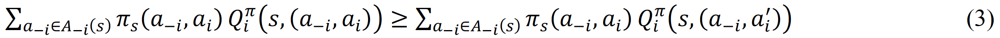
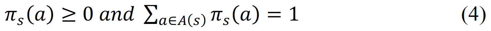
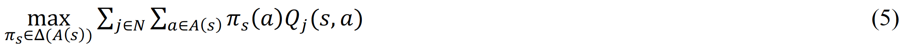
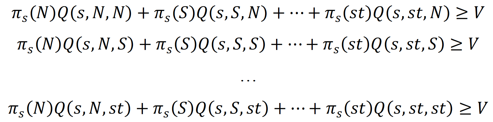
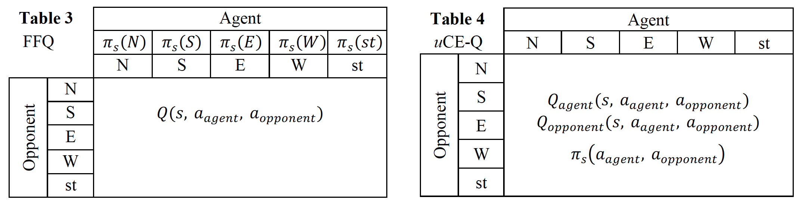
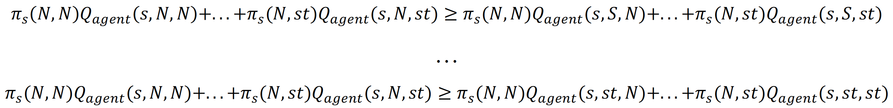
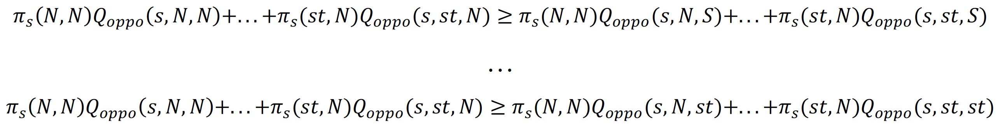
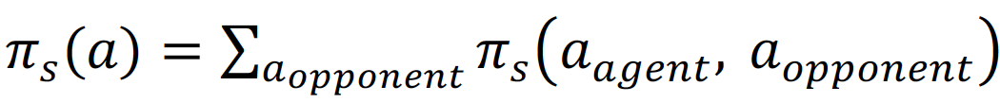
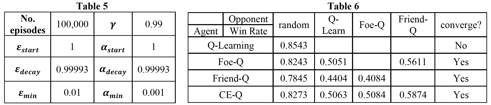
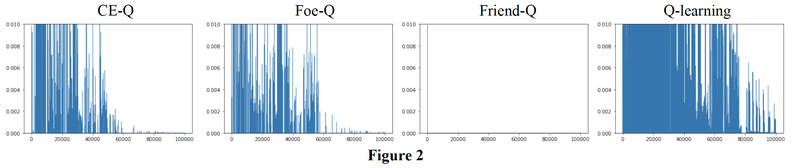

# Markov games, a case study

### Code overview

- `soccer.py` implements the soccer game enviroment, with `reset`, `step` and `render` fucntions similar to those of an OpenAI gym enviroment
- `agents.py` implements an interface to unify all the player algorithms used in the game. It implements an `act` function that produces player action and `learn` function that takes current state action and reward information to learn the Q table and policy for that player.
- `randomAgent.py` implements a random player
- `QlearningAgent.py` implements a Q learning player.
- `CEQ.py` implements a utilitarian CE-Q player.
- `FoeQ.py` implements a Foe-Q player.
- `FriendQ.py` implements a Friend-Q player.
- `game_interface.py` implements the game interface, where it takes the game enviroment and implementations of the agent and the opponent to play the game.
- `run_game.py` uses all the code above to test the performance and convergence of different algorithms.

### The soccer game enviroment

Here I am going to implement different learning agents to solve a grid game called “the soccer game” and analyze their convergence and performance. The game mechanism is described in [1] “The soccer field is a grid. The circle represents the ball. There are two players, whose possible actions are N, S, E, W, and stick. The players’ actions are executed in random order. If this sequence of actions causes the players to collide, then only the first moves. But if the player with the ball moves second, then the ball changes possession. If the player with the ball moves into a goal, then he scores +100 if it is in fact his own goal and the other player scores −100, or he scores −100 if it is the other player’s goal and the other player scores +100. In either case, the game ends.” The starting positions for A, B and the ball possession in the beginning is random. Soccer game is an instance of Markov games.

### Markov games
A Markov Decision Process (MDP) is defined by a set of states (S), actions (A), the transition function P(s,a,s’) and the reward function R(s,a,s’) [2]. The two functions reflect the Markovian property that it is memoryless. In an MDP, the agent acts alone to try to maximize the long-term discounted reward at each step. An MDP can be solved using Q-learning based on the Bellman equation [1].

Where V*(s') is the expected utility following the optimal policy π*. In the case of MDP:

MDP is a very useful model in reinforcement learning and has helped researchers in this filed to very impressive achievements such as Gerald Tesauro’s celebrated work on TD-Gammon, which enabled a program to learn and play the game of backgammon at the grandmaster level [3] and the program AlphaGo developed by a team at DeepMind to master the game of Go [4]. However, in the real world, no agent lives in a vacuum and it needs to interact with other agents, engaging in competitions and/or collaborations to maximize its own gain. To solve these problems, it is necessary to expand a single-agent MDP to include two or more agents.

To simplify the problem, we first look at a one-step MDP and add an extra agent to it, such as the game of “rock, paper, scissors”. In game theory terms, this is a two-player, three-action, one-shot, zero-sum game. This game can be fully represented by a game matrix as shown in Table 1 [5].

In this one-shot game, the agent has to find an optimal strategy (probabilities of playing rock, paper or scissors) so it can maximize its immediate reward. Game theory offers various ways of solving this problem, which will be covered later. Now if we return to the context of a regular MDP, which contains many steps, each is represented by a one-shot game, the optimal strategy for each one-shot game now becomes the optimal policy at the current state π_s^*. This is made possible due to the Markovian property as the current one-shot game is not affected by previous steps. This is called a Markov game, a combination of an MDP and one-shot games. 

### Markov game algorithms
If we can compute the optimal strategy at each state π_s^* for a Markov game, we will be able to compute V^* (s') and Q^* (s,a) using Equation 1 and use Q-learning to solve the problem. In game theory, a Nash equilibrium is a vector of independent strategies, each of which is a probability distribution over actions, in which each agent’s strategy is optimal given the strategies of the other agents [6]. One can therefore compute the Nash-equilibrium for each state to solve any finite, multi-player, general-sum Markov game [7]. Although the Nash-Q algorithm is highly general, the assumptions that are known to be sufficient to guarantee its convergence are quite restrictive. To circumvent these restrictions, several algorithms have been proposed, including Foe-Q [8], Friend-Q [9] and Correlated-Q [1, 6], our discussion here is limited to finite, two-player Markov games.

#### 1. Friend-or-foe Q-learning (FFQ)
FFQ requires that the other player is identified as being either “friend” or “foe”. Foe-Q is used to solve zero-sum games and Friend-Q can be used to solve general sum games assuming both players are cooperative and are getting the same reward. FFQ always converges and in games with coordination or adversarial equilibria, FFQ converges to precisely the Nash-Q equilibrium [9].
As an example, for the “rock, paper, scissors” game shown in Table I, Foe-Q assumes that the opponent gets the opposite rewards as the agent (which should be the case) and will always act to minimize the agent’s gain. The optimal strategy is then to maximize the reward when the opponent is trying to minimize it. This minimax algorithm is shown in Table 2 [5] as a series of inequality equations with the goal of maximizing V and can be solved by linear programming.
For the same game, Friend-Q assumes that the opponent gets the same rewards as the agent (which is not the case) and will therefore collaborate with the agent. The optimal strategy is then to always choose the action with the best reward in the game matrix because the opponent would do the same under these assumptions. It is interesting to point out that even when the assumption is wrong here, the Friend-Q algorithm will nonetheless produce the correct strategy π(rock)=1⁄3,π(paper)=1⁄3,π(sissors)=1⁄3 as all three actions have the same max reward of 1.
#### 2. Correlated-Q
The Correlated-Q (CE-Q) algorithm calculates correlated equilibria. A correlated equilibrium (CE) is a joint distribution over actions from which no agent is motivated to deviate unilaterally. It is more general than a Nash equilibrium in that it allows for dependencies among agents’ strategies [6]. It introduces a “referee”. At the beginning of each step, the referee will broadcast a policy to all players. If the policy is a CE, all players should follow the referee’s recommendation as deviating from it will not lead to additional reward gain for any player when all other player adhere to the recommendation. For the “rock, paper, scissors” game, a CE is an equal distribution of {(r,P),(r,S),(p,R),(p,S),(s,R),(s,P)}.

A CE can sometimes perform better than a Nash for all players because it is able to eliminate unwanted action vectors (e.g. all players lose). And like FFQ, CE-Q is guaranteed to converge to stationary correlated equilibrium policies in zero-sum and common-interest Markov games [6]. To solve CE-Q, we need three sets of inequality equations. The first set defines the CE [6]. It means that switching for any player alone is not beneficial.

The second set defines the boundary of the probabilities.

The third defines the objective of the CE (or the referee), it can be one of the four
- utilitarian, maximize the sum of all agents’ rewards
- egalitarian, maximize the minimum of all agents’ rewards
- plutocratic, maximize the maximum of all agents’ rewards
- dictatorial, maximize the maximum of any individual agent’s rewards.

Here we only used utilitarian, and we refer to this algorithm as uCE-Q.

Given these three sets of inequalities, we can solve π_s(a) using linear programming.

### Implementation
The code of the soccer game environment, the agents and the environment-agent interface are available online with detailed comments. All agent algorithms are de-centralized and follow the design in [6] Table 2 given π_s(a), so learning and acting of the two agents in the soccer game are independent of each other. In this section, I focus only on how to calculate π_s(a) for different agents during learning according to the algorithm descriptions in the previous section. 
There are five different agents implemented in this project, a random agent, a Q-learning agent, a Foe-Q learning agent, a Friend-Q learning agent and a uCE-Q learning agent. All agents are unified by the same interface implementing an act function and a learn function. Calculating π_s(a) for the random agent is trivial as it chooses each action with equal probability. The Q-learning agent chooses the action with the highest Q(s,a) deterministically disregarding the opponent’s action.

The Friend-Q agent uses the game matrix shown in Table 3. It calculates π_s(a) by doing max-max: first pick the max Q value from each column then pick the max among these max values and break tie randomly.

The Foe-Q agent uses the same game matrix as Friend-Q (Table 3) but calculates min-max instead. To do this, we introduce the value V (see also Table 1 and 2) as the minimal utility the opponent’s action can cause the agent to have given a policy π_s(a). Given this definition, we get five inequality equations:

We then add Equation (4) as probability constraints and maximize V to achieve minimax.  π_s(a) is then solved using linear programming.

The game matrix for CE-Q is different from FFQ (Table 4). It includes the opponent’s Q table and probabilities for each agent-opponent action pair because CE is a joint distribution over actions. As we discussed in the previous sections, according to the definition of CE, we have:

These are a set of 4 equations stating that when instructed to choose N the agent has no gain to switch to 4 alternative actions. The same logic applies to the opponent:

There are 5 actions, so a total 5x4=20 inequality equations for the agent and another 20 for the opponent. Additionally, we have Equation (4) as probability constraints and we aim to achieve Equation (5). π_s(a_agent,a_opponent) is then solved using linear programming and

### Results and analysis
The learning parameters are the same for all agents (Table 5). Agents are trained against opponents of the same type (e.g. Foe-Q vs Foe-Q). To evaluate the performance of trained agents, we let them compete against each other and also against an opponent that always act randomly (Table 6). Results are calculated from 10000 games.

All trained agents had above 50% win rates against the random opponent, showing that the training was successful. When compete against each other, we found that the win rate of CEQ = FoeQ = Q learning > FriendQ. It is interesting to note that Friend-Q interpreted the opponent’s move erroneously therefore performed poorly but still converge. Q learning performed well although it did not converge (see below).

Having established that our game environment and the agents are working. Next I looked at the convergence for each algorithm in the soccer game. The result is shown in Figure 2. The y-scale is fixed at [0~0.01] to make figures comparable between each other. The result is very similar compared to Figure 3 in [1]. CE-Q and Foe-Q had very similar convergence pattern because in this two-player, zero-sum game they converge to the same equilibrium. Friend-Q converged very fast, the same as in the paper. Last but not least, Q-learning failed to converge. The reduction in error was only bounded by the reducing alpha value towards the end of the training. This is because it failed to consider its opponent’s action’s impact on the state and reward values and won't stabilize in such a non-stationary environment.

### References
1. Amy Greenwald, Keith Hall, and Roberto Serrano. Correlated Q-learning. In: ICML. Vol. 20. 1. 2003, p. 242.
2. Richard S. Sutton and Andrew G. Barto. 2018. Reinforcement Learning: An Introduction. A Bradford Book, Cambridge, MA, USA.
3. Tesauro, Gerald. Temporal Difference Learning and TD-Gammon. Communications of the ACM. 38 (3): 58–68 (1995). doi:10.1145/203330.203343
4. Silver, D., Huang, A., Maddison, C. et al. Mastering the game of Go with deep neural networks and tree search. Nature 529, 484–489 (2016). https://doi.org/10.1038/nature16961
5. Michael L. Littman. 1994. Markov games as a framework for multi-agent reinforcement learning. In Proceedings of the Eleventh International Conference on International Conference on Machine Learning (ICML’94). Morgan Kaufmann Publishers Inc., San Francisco, CA, USA, 157–163.
6. Amy Greenwald, Keith Hall and Martin Zinkevich. 2005. Correlated Q-Learning. Brown University Technical Report. CS-05-08.
7. Junling Hu and Michael P. Wellman. 2003. Nash q-learning for general-sum stochastic games. J. Mach. Learn. Res. 4, (12/1/2003), 1039–1069.
8. Michael L. Littman. 1994. Markov games as a framework for multi-agent reinforcement learning. In Proceedings of the Eleventh International Conference on International Conference on Machine Learning (ICML’94). Morgan Kaufmann Publishers Inc., San Francisco, CA, USA, 157–163.
9. Michael L. Littman. 2001. Friend-or-Foe Q-learning in General-Sum Games. In Proceedings of the Eighteenth International Conference on Machine Learning (ICML ’01). Morgan Kaufmann Publishers Inc., San Francisco, CA, USA, 322–328.
